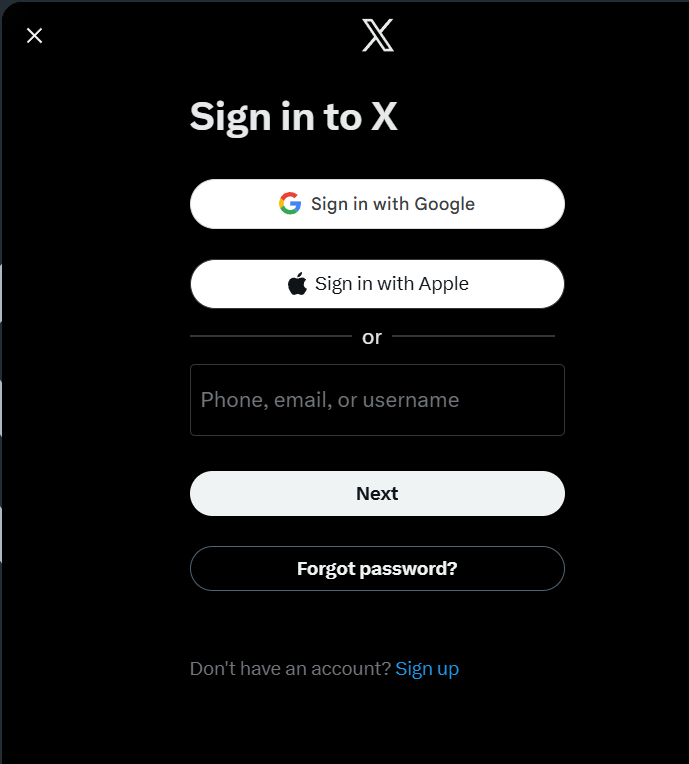

# X Login Page Clone

A front-end clone of the **X (formerly Twitter)** login page built using **HTML and CSS**.  
This project focuses on recreating the UI, layout, and dark-theme design of the original login screen.

---

## 📸 Preview

---

## 🚀 Features

- Dark mode UI inspired by X
- Google & Apple sign-in buttons (UI only)
- Clean and minimal layout
- Responsive design
- Modern typography and icons
- Pixel-aligned components

---

## 🛠️ Tech Stack

- **HTML5**
- **CSS3**
- **Google Fonts**
- **Font Awesome**

---

## 📂 Project Structure

